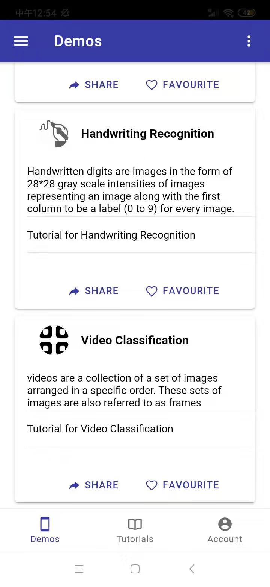

# AI Interactive Teacher

## Install

- Download Node.js and install ：`https://nodejs.org/dist/v8.9.4/node-v8.9.4-x64.msi`;
- Clone source code to local, open with VSCode;
- Run the command in VSCode command：`npm i`, download related dependencies;
- Run the command in VSCode command：`ionic serve --appdev`, run the project;
- Access address: `http://localhost:80**`, you can open the AI Iteractive Teacher system page

## Project Description

The AI ​​Iteractive Teacher application is an AI technology teaching program based on ionic and TensorFlow.js. The main part of AI Iteractive Teacher consists of four unique features including image classification demo, image recognition demo, digital prediction demo and video classification demo. There are also tutorial learning and user management modules.

### Application Overview

With the rapid development of AI technology in recent years, more and more AI technologies have been practiced in the industry. In order to meet the needs of science and engineering talents for AI learning, we are committed to developing a simple and efficient AI teaching platform. The platform simplifies the learning cost of the AI algorithm core through algorithmic diagrams, text descriptions and high-level packaging. The complete process of AI work can be deeply experienced through simple parameter adjustment and data collection. By using deep learning frameworks such as Tensorflow, beginners do not have to delve into complex mathematical models. We ported the web-side project to the mobile app via Ionic5. Therefore, users can learn quickly and easily anytime, anywhere.

## Demo Screenshoots

### Image Recognition

- Image Recognition Module designed to detect multiple objects within an image with bounding boxes. Recognize 80 different classes of objects. We shall add training image and give label to this image. Then we shall train model. After numbers of iteration, we will get the value of loss function of the training process. Then we use camera to capture pictures of faces, we can get the confidence of prediction.

 <label>The entrance of Image Recognition</label>

 <label>The Demo of Image Recognition</label>

- Image Classification Module designed to use a pre-trained and optimized model to identify hundres of classes of objects, including people, activities, animals, plants and places. We shall upload an image for classification. We choose a image from local files. Pre-trained model MobileNet will give us the confidence of prediction about the class of this image. At the bottom of the screen will show the image we added in to the model.

 <label>The entrance of Image Classification</label>

 <label>The Demo of Image Classification</label>

- Handwritten digits are images in the form of 28*28 gray scale intensities of images representing an image along with the first column to be a label(0 to 9) for every image. We shall draw numbers between 0 to 9 into the canvas. We will get the prediction when fingertips leave from the screen. If we tap the erase button, the canvas will clean up.

 <label>The entrance of Handwriting Recognition</label>

 <label>The Demo of Handwriting Recognition</label>

- Videos are a collection of a set of images arranged in a specific order. These sets of images are also referred to as frames. The video stream is captured by front camera. It will return the confidence of prediction of the major object. 

 <label>The entrance of Video Recognition</label>

 <label>The Demo of Video Recognition</label>

## Demo video and slides

[Youtube video](https://www.youtube.com/watch?v=mOdNy_5uEXA)
[Google Slides](https://docs.google.com/presentation/d/12DS54S2c_rJLAMLo-wz5fPpsLQ1L9zVnckGMmmMcuEY/edit#slide=id.g7091fb960e_0_7)

## Contributor

- Zhengyuan Zhu
- Yao Cheng
- Jing Guan
- Yunyao Cheng
- Guanxiong Ding
- Shuji Wang
- Aijing Han
